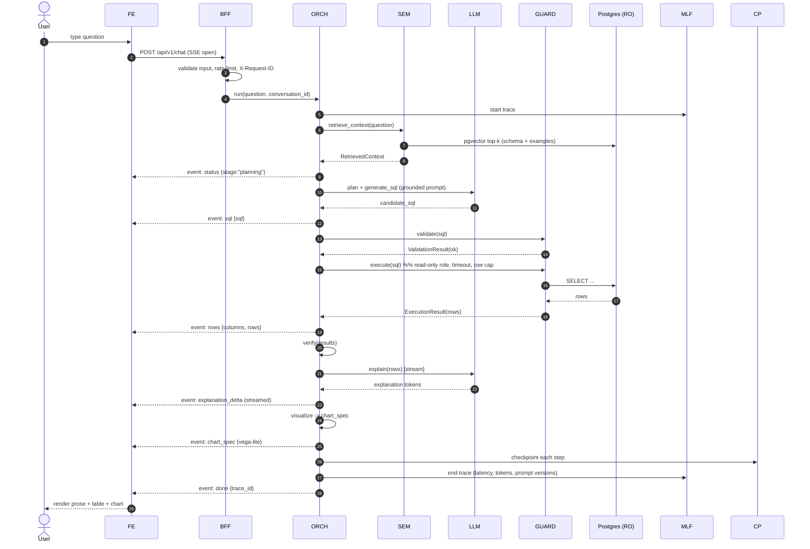
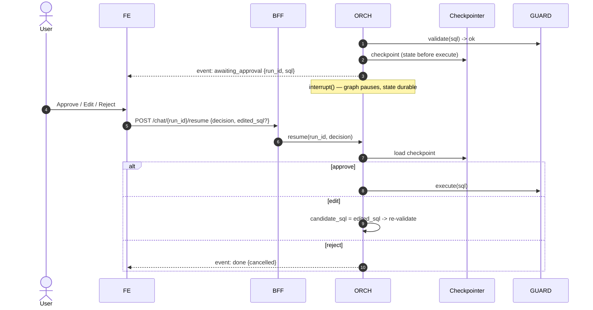
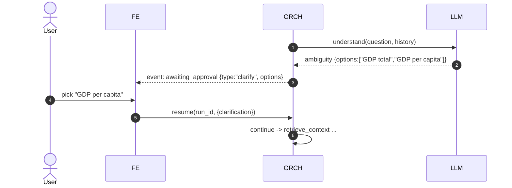
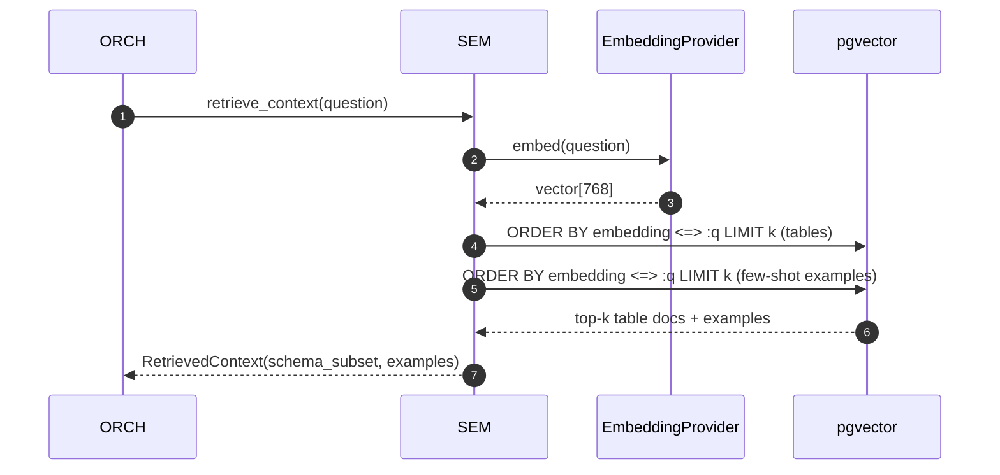
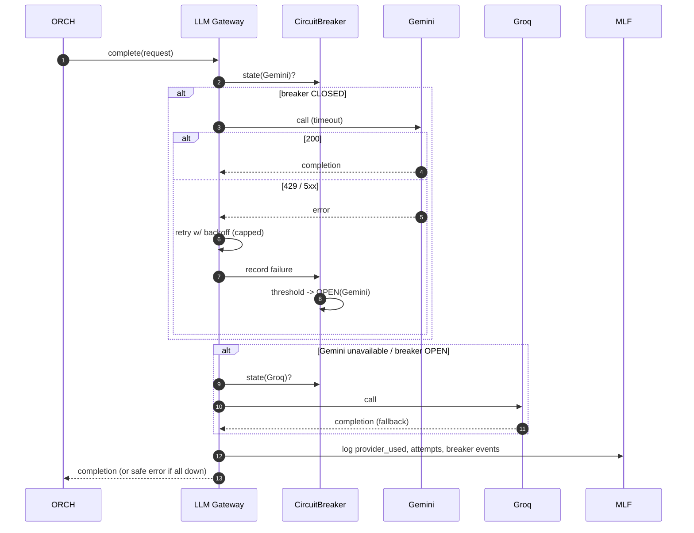
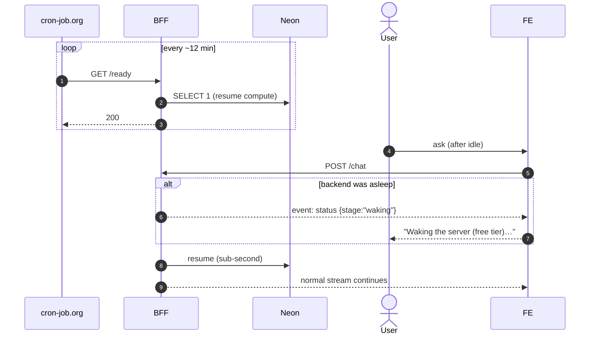
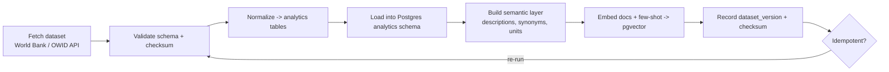
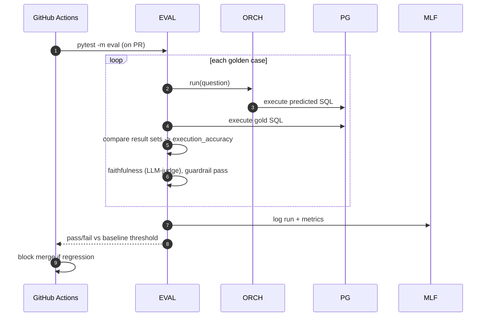

# AppFlow — DataChat

> **Application Flow** — end-to-end journeys and lifecycles as sequence diagrams.
> Reads alongside [TechSpec](./TechSpec.md) (§4 API, §5 agent) and [Design](./Design.md) (classes).

---

## 1. Journeys at a glance

1. **Ask → grounded answer** (happy path, streaming).
2. **HITL — approve/edit SQL** before execution.
3. **HITL — clarify** an ambiguous question.
4. **RAG retrieval** (schema + few-shot grounding).
5. **Resilience** — retry → circuit breaker → provider fallback.
6. **Self-repair loop** on a bad query.
7. **Cold-start / keep-warm** (free-tier reality).
8. **Ingestion** (offline).
9. **Evaluation** (CI gate).

Legend: **FE** Next.js · **BFF** API gateway · **ORCH** LangGraph orchestrator · **SEM** semantic layer · **LLM** provider gateway · **GUARD** SQL guardrail+executor · **PG** Postgres · **CP** checkpointer · **MLF** MLflow.

## 2. Happy path — ask → streamed answer



## 3. HITL — approve / edit SQL

Interrupt happens **after** the guardrail passes but **before** execution, so a human sees exactly what will run.



*Why this matters:* the pause is server-side and durable — a user can close the tab, the host can sleep, and the run resumes from the checkpoint. The approval cannot be bypassed by the client (mitigates ASI09 *Human-Agent Trust Exploitation*).

## 4. HITL — clarify ambiguous question



## 5. RAG retrieval (grounding)



Only the retrieved subset enters the SQL-gen prompt — small context, narrower surface, fewer hallucinations.

## 6. Resilience — retry → circuit breaker → fallback



If **all** providers are exhausted, the user gets `event: error {code:"providers_unavailable", message:"Busy right now — try again shortly."}` — never a stack trace.

## 7. Self-repair loop

```mermaid
sequenceDiagram
  autonumber
  participant ORCH
  participant GUARD
  participant PG
  participant LLM
  ORCH->>GUARD: execute(sql)
  GUARD->>PG: SELECT ...
  PG-->>GUARD: error "column x does not exist"
  GUARD-->>ORCH: ExecutionResult(error)
  ORCH->>ORCH: verify -> repair? (attempts < MAX)
  ORCH->>LLM: generate_sql(question, schema, error_feedback)
  LLM-->>ORCH: repaired_sql
  ORCH->>GUARD: validate -> execute (retry)
  Note over ORCH: repair_attempts++ ; hard cap prevents infinite loops (ASI08)
```

## 8. Cold-start / keep-warm



## 9. Ingestion (offline)



Chain-of-Responsibility pipeline; each step is a link with a uniform `process(context)` contract (see [Design](./Design.md)).

## 10. Evaluation (CI gate)


