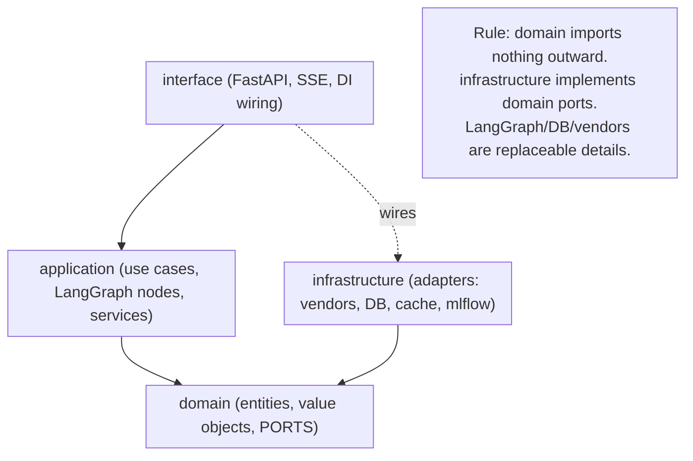
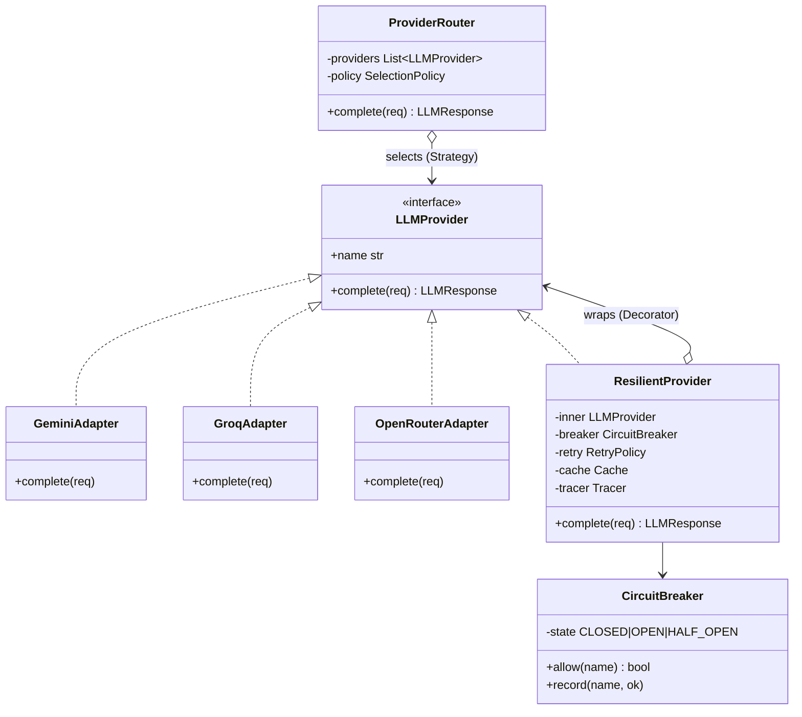
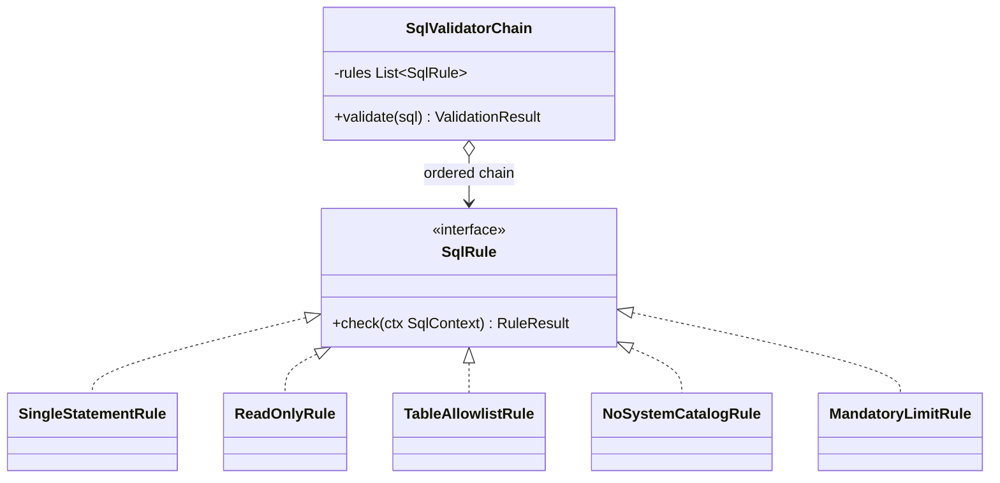
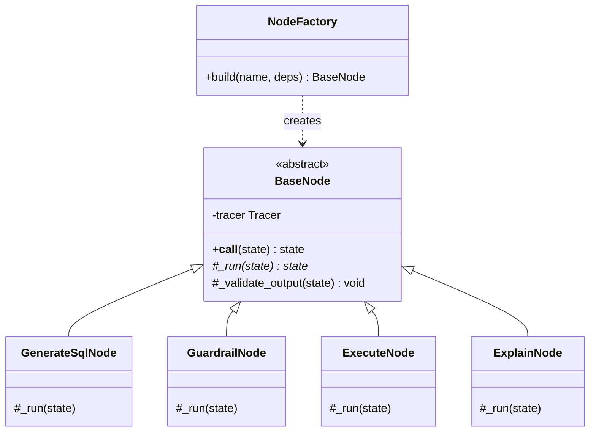

# Design — DataChat (Low-Level Design)

> **The flagship doc.** This reads like a senior engineer's design review: layering, interfaces, class diagrams, and every pattern applied *with a justification and the SOLID tie-in*. Patterns are named in code docstrings too (see [Rules](./Rules.md)).
> Context: [TechSpec](./TechSpec.md) · data: [Schema](./Schema.md) · flows: [AppFlow](./AppFlow.md).

---

## 1. Clean architecture & the dependency rule

Four layers; **dependencies point inward only**. The domain knows nothing about FastAPI, SQLAlchemy, LangGraph, or any vendor. Those are *details* behind interfaces (ports), so they are swappable — this is Dependency Inversion (the "D" in SOLID) applied at the system scale.



**Why this is worth defending in an interview:** if a hiring manager asks "what if Groq dies, or you must drop LangGraph?" the answer is "swap an adapter / an orchestrator implementation; the domain and use cases don't change." That is the payoff of DIP, and it's the difference between a wired-together demo and a designed system.

## 2. Package layout

```
backend/app/
├── domain/                     # pure business core — no framework imports
│   ├── entities.py             # Conversation, Turn, SqlQuery, QueryResult...
│   ├── value_objects.py        # ConversationId, Vector, ChartSpec, Units...
│   ├── results.py              # Result/Either types, typed errors
│   └── ports/                  # interfaces (the seams)
│       ├── llm.py              # LLMProvider, EmbeddingProvider
│       ├── catalog.py          # SchemaCatalog (RAG retrieval)
│       ├── sql.py              # SqlValidator, QueryExecutor
│       ├── repositories.py     # ConversationRepository, ExampleRepository, EvalRepository
│       ├── cache.py            # Cache
│       └── tracing.py          # Tracer
├── application/                # orchestration — depends only on domain ports
│   ├── agent/
│   │   ├── state.py            # LangGraph state (TypedDict + reducers)
│   │   ├── graph.py            # GraphBuilder (Builder pattern)
│   │   ├── base_node.py        # BaseNode (Template Method: trace/validate hooks)
│   │   └── nodes/              # understand, retrieve, plan, generate_sql,
│   │                           #   guardrail, execute, verify, repair, explain, visualize, respond
│   ├── services/
│   │   ├── query_service.py    # use-case facade for a chat turn
│   │   ├── semantic_layer.py   # retrieval orchestration
│   │   └── eval_service.py     # golden-set runner + scorers
│   └── prompts/                # prompt templates (registered/versioned in MLflow)
├── infrastructure/             # adapters implementing domain ports
│   ├── llm/
│   │   ├── base_adapter.py     # shared HTTP/timeout logic
│   │   ├── gemini.py  groq.py  openrouter.py   # Adapters
│   │   ├── router.py           # ProviderRouter (Strategy)
│   │   ├── circuit_breaker.py  # CircuitBreaker
│   │   └── decorators.py       # Retry/Cache/Trace decorators
│   ├── sql/
│   │   ├── validator.py        # guardrail Chain of Responsibility (sqlglot)
│   │   └── executor.py         # read-only executor (separate engine/role)
│   ├── db/
│   │   ├── models.py  session.py  repositories.py  checkpointer.py
│   ├── catalog/                # pgvector-backed SchemaCatalog
│   ├── cache/redis_cache.py
│   ├── connectors/             # DatasetConnector Adapters (world_bank.py, owid.py)
│   └── observability/          # mlflow_tracer.py, logging.py
├── interface/
│   ├── api/                    # routers (chat, resume, datasets, health), schemas, middleware
│   └── deps.py                 # FastAPI dependency providers
├── config.py                   # Pydantic Settings
└── container.py                # composition root (Factory/DI wiring)
ingestion/                      # offline pipeline (Chain of Responsibility)
tests/  unit/ integration/ agent_eval/ security/
migrations/                     # Alembic
```

## 3. Key ports (interfaces / contracts)

```python
# domain/ports/llm.py
class LLMProvider(Protocol):
    name: str
    async def complete(self, req: LLMRequest) -> LLMResponse: ...

class EmbeddingProvider(Protocol):
    async def embed(self, text: str) -> Vector: ...

# domain/ports/catalog.py
class SchemaCatalog(Protocol):
    async def retrieve(self, question: str, k: int = 8) -> RetrievedContext: ...

# domain/ports/sql.py
class SqlValidator(Protocol):
    def validate(self, sql: str) -> ValidationResult: ...   # pure, sync, no I/O

class QueryExecutor(Protocol):
    async def execute(self, sql: str) -> ExecutionResult: ...  # read-only role only

# domain/ports/repositories.py
class ConversationRepository(Protocol):
    async def get(self, cid: ConversationId) -> Conversation | None: ...
    async def append_turn(self, cid: ConversationId, turn: Turn) -> None: ...

# domain/ports/cache.py
class Cache(Protocol):
    async def get(self, key: str) -> bytes | None: ...
    async def set(self, key: str, value: bytes, ttl_s: int) -> None: ...
```

Ports are **small and role-specific** (Interface Segregation): the executor doesn't know about validation; the catalog doesn't know about LLMs.

## 4. Pattern catalog — applied, justified, or rejected

Every entry says *where*, *why*, and the *SOLID* it serves. No cargo-culting: rejected patterns are listed too.

| Pattern | Where | Why (and the trade-off) | SOLID |
|---|---|---|---|
| **Adapter** | `infrastructure/llm/*`, `connectors/*` | Wrap each vendor (Gemini/Groq/OpenRouter) + each dataset behind one interface, so the core is vendor-agnostic. Trade-off: a thin translation layer per vendor. | DIP, OCP |
| **Strategy** | `ProviderRouter`, retrieval strategy, chart-type selection | Swap the *algorithm* (which provider, which retriever, which chart) at runtime via config. | OCP, DIP |
| **Decorator** | `llm/decorators.py` (Retry → Cache → Trace → CircuitBreaker) | Layer cross-cutting concerns around a provider call without editing the adapter. Order matters and is explicit. | SRP, OCP |
| **Circuit Breaker** | `llm/circuit_breaker.py`, external calls | Stop hammering a failing free API; fail fast + fall over. Central to surviving flaky free tiers. | SRP |
| **Chain of Responsibility** | SQL guardrail pipeline; ingestion pipeline | Each rule/step is an independent link with a uniform contract; add/reorder without touching others. | SRP, OCP |
| **Repository** | `db/repositories.py` | Isolate persistence behind domain ports; domain never sees SQLAlchemy. | DIP, SRP |
| **Factory / composition root** | `container.py` | One place builds and wires concrete adapters to ports (DI). Keeps constructors dumb. | DIP, SRP |
| **Builder** | `agent/graph.py` GraphBuilder | Assemble the LangGraph `StateGraph` (nodes/edges/checkpointer) step-by-step, config-driven. | SRP, OCP |
| **Template Method** | `agent/base_node.py` | Base node fixes the skeleton (start span → run → validate output → checkpoint); subclasses fill `_run`. Guarantees every node is traced + output-validated (LLM05). | OCP, LSP |
| **Command** | ingestion / eval jobs | Encapsulate a job as an object that can be queued/run/retried. | SRP |
| **Observer** | SSE event bus; audit outbox | Nodes publish progress events; subscribers (SSE stream, audit log) react. Decouples producers from consumers. | OCP, SRP |
| **Singleton (scoped)** | settings, engine, client registries — via DI, not globals | One instance where identity matters; created in the composition root, injected, mockable in tests. | — (used sparingly) |
| **Result/Either** | `domain/results.py` | Make failure explicit in signatures instead of exceptions for control flow. | SRP |

**Rejected / deferred (equally important to be able to justify):**

| Pattern | Verdict | Reason |
|---|---|---|
| **CQRS** | Rejected (v1) | Read-heavy, single store; splitting reads/writes adds machinery with no payoff. Would be cargo-culting. |
| **Saga (distributed)** | Deferred | Only the *ingestion* pipeline is multi-step; it's single-process, so a simple sequential pipeline + idempotency beats a saga. Revisit if steps span services. |
| **Event Sourcing (full)** | Partial only | We keep an **append-only audit/outbox** of agent actions (great for the "what did the agent do" trail) but do **not** rebuild state from events — overkill here. |
| **Abstract Factory (families)** | Not needed | A single Factory suffices; no families of related objects vary together. |

## 5. Class diagram — LLM Provider Gateway (Adapter + Strategy + Decorator + Circuit Breaker)



Reading it: `ProviderRouter` (Strategy) picks a provider; each provider is a `ResilientProvider` (Decorator) that adds retry/cache/trace/breaker around a raw vendor `Adapter`. Add a vendor → new adapter + config line; the router and callers don't change (**OCP**).

## 6. Class diagram — SQL Guardrail (Chain of Responsibility)



Each rule parses the sqlglot AST and returns pass/fail with a reason. The chain short-circuits on the first hard failure. New rule = new class appended to config; existing rules untouched (**SRP + OCP**). This is defence-in-depth layer #1; the **read-only DB role** is layer #2 (see [Schema](./Schema.md) §5).

## 7. Class diagram — Agent node (Template Method + Factory)



`BaseNode.__call__` runs the invariant skeleton — open MLflow span → `_run` → `_validate_output` (treat LLM output as untrusted, LLM05) → checkpoint — and each subclass implements only `_run`. So *every* node is guaranteed traced and output-validated; you can't forget it.

## 8. SOLID — concrete mapping

| Principle | Concrete manifestation |
|---|---|
| **S**RP | One reason to change per unit: each guardrail rule, each node, each adapter, each repository. |
| **O**CP | Add a provider/rule/dataset/chart type via new class + config; no edits to callers (Strategy/Adapter/CoR). |
| **L**SP | Any `LLMProvider` (real, resilient, or mock) is interchangeable; tests inject fakes freely. |
| **I**SP | Tiny role ports (`SqlValidator`, `QueryExecutor`, `Cache`) — no fat "service" interface. |
| **D**IP | Domain/application depend on ports; `container.py` injects infrastructure. LangGraph, SQLAlchemy, vendors are details. |

## 9. Microservice / distributed patterns (applied within the modular monolith)

| Pattern | Applied as |
|---|---|
| **API Gateway / BFF** | The FastAPI edge shapes responses for the UI, owns auth-lite + rate-limit + SSE. |
| **Circuit Breaker** | Per LLM provider (and external HTTP) — the headline resilience control for flaky free APIs. |
| **Retry with backoff + jitter** | In the Decorator stack; respects `Retry-After`. |
| **Bulkhead** | Query execution uses a **separate DB engine/pool + read-only role**, isolating analytics load and blast radius from app traffic. |
| **Idempotency key** | `Idempotency-Key` header → Redis dedupe, so a retried `POST /chat` doesn't double-run. |
| **Outbox / audit trail** | Append-only `agent_action` log of every SQL executed + decision (audit + debugging; partial event-sourcing). |
| **Health/readiness + keep-warm** | `/health`, `/ready`, external ping to survive scale-to-zero. |

## 10. Error handling & degradation

- Domain uses typed errors + `Result` where failure is expected (invalid SQL, empty result); exceptions only for truly exceptional cases.
- The BFF maps internal errors to **safe, user-facing messages** with a stable code and the `trace_id` — never a stack trace (LLM05, good UX).
- Every terminal path (all providers down, repair budget exhausted, guardrail refusal) has a defined, tested user message.

## 11. Concurrency & async

Fully async I/O (FastAPI, asyncpg, httpx). CPU-bound work (offline embedding during ingestion) runs in the ingestion job, **off** the request path and off the tiny prod host. The backend is **stateless** (state in Postgres/Redis) so it is horizontally scalable in principle (NFR-10), even though the free tier runs one instance.
