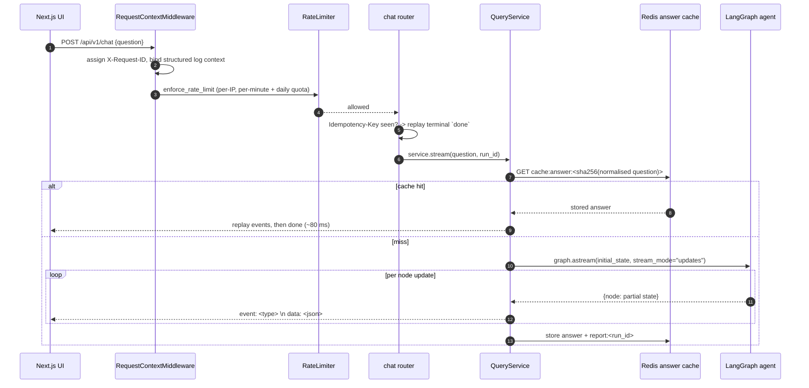
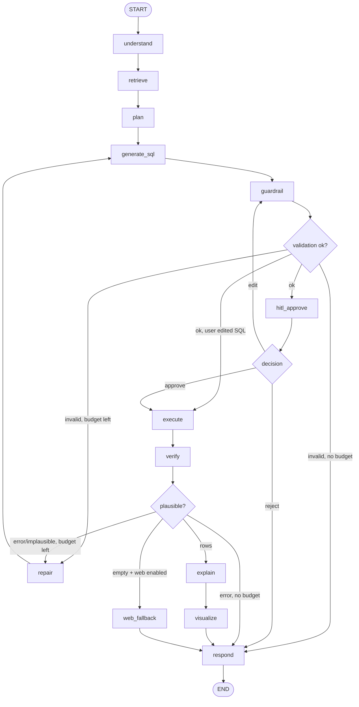
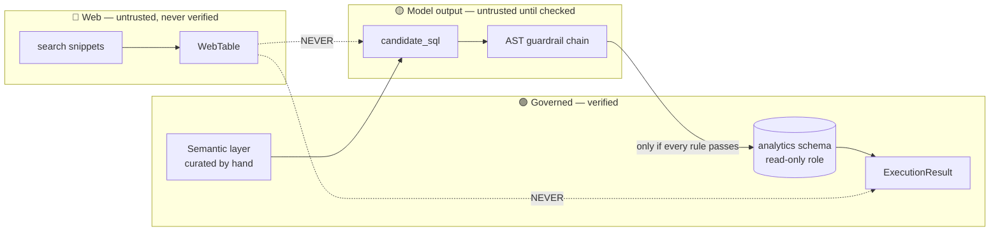
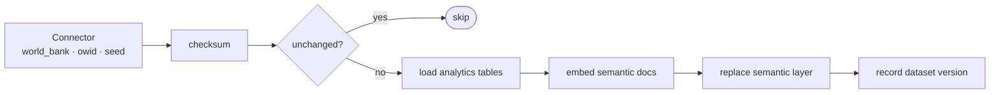
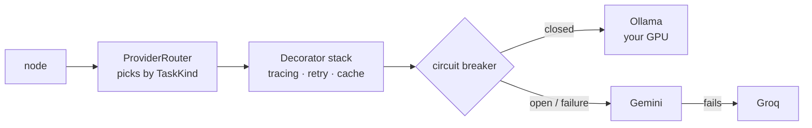
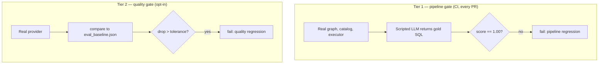
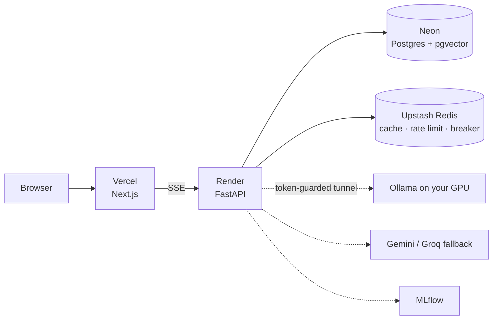

# FLOW — how a question becomes an answer

A single-file walkthrough of the system, from an HTTP request to a rendered chart,
with the trust boundaries marked. Read this before the code; every section names
the files it describes.

**Contents**
1. [The 10-second version](#1-the-10-second-version)
2. [Request lifecycle](#2-request-lifecycle)
3. [The agent graph](#3-the-agent-graph)
4. [Node by node](#4-node-by-node)
5. [Trust boundaries](#5-trust-boundaries)
6. [The SSE event contract](#6-the-sse-event-contract)
7. [Where data comes from](#7-where-data-comes-from-ingestion)
8. [How the LLM call is made](#8-how-the-llm-call-is-made)
9. [Caching and reports](#9-caching-and-reports)
10. [How it is evaluated](#10-how-it-is-evaluated)
11. [Failure modes](#11-failure-modes-and-what-the-user-sees)
12. [Deployment topology](#12-deployment-topology)

---

## 1. The 10-second version

A question goes to a **LangGraph agent**. The agent retrieves a *semantic layer*
(schema docs + few-shot examples, via pgvector) so the model writes SQL against
real columns instead of invented ones. The SQL is parsed to an **AST and
guardrailed** before it runs, then executed by a **read-only Postgres role**. The
result is verified, explained, charted, and streamed to the browser over **SSE**.

Two things make it defensible rather than a demo: nothing unsafe can execute even
if the model is fully compromised, and the whole thing is measured by a golden set
with a gate that is calibrated to fail.

---

## 2. Request lifecycle



**Files.** [`interface/api/middleware.py`](backend/app/interface/api/middleware.py) ·
[`interface/api/rate_limit.py`](backend/app/interface/api/rate_limit.py) ·
[`interface/api/routers/chat.py`](backend/app/interface/api/routers/chat.py) ·
[`interface/api/sse.py`](backend/app/interface/api/sse.py) ·
[`application/services/query_service.py`](backend/app/application/services/query_service.py)

Three things worth noticing:

- **The route is `/api/v1/chat`.** Streaming responses use
  `StreamingResponse(..., media_type="text/event-stream")`.
- **`Idempotency-Key` is honoured.** A retried POST with the same key does not
  re-run the agent; it replays a terminal `done` pointing at the original run.
- **Every error inside the stream becomes a safe `error` event.** A stack trace
  never reaches the client — see `_SAFE_MESSAGES` in `query_service.py`.

---

## 3. The agent graph

Built by `GraphBuilder` in
[`application/agent/graph.py`](backend/app/application/agent/graph.py). Solid lines
are unconditional edges; diamonds are conditional routers.



**Safety lives in the routing, not in a prompt:**

- Nothing reaches `execute` without passing `guardrail`.
- `hitl_approve` is a **durable server-side interrupt** — the run pauses in the
  checkpointer and survives a reload or a cold start.
- The repair loop is hard-capped by `max_repair_attempts` (default 2), so it
  cannot run away. This is OWASP Agentic **ASI08**.
- A user *edit* of the SQL re-enters `guardrail`, never `execute` directly. Edited
  SQL is still untrusted input.

State is a `TypedDict` (`total=False`) so each node returns a partial update that
LangGraph merges — see
[`application/agent/state.py`](backend/app/application/agent/state.py).

---

## 4. Node by node

| Node | Does | Can it interrupt? |
|---|---|---|
| `understand` | Cheap ambiguity check. If the question is vague, `interrupt()` asks the user to choose. | yes (clarify) |
| `retrieve` | Embeds the question once, cosine top-k over semantic tables + few-shot examples via pgvector. | no |
| `plan` | Turns the question + retrieved context into ordered steps and target tables. | no |
| `generate_sql` | Writes candidate SQL grounded **only** in the retrieved schema. | no |
| `guardrail` | Parses to AST and runs the rule chain. Nothing proceeds on failure. | no |
| `hitl_approve` | Durable interrupt: approve / edit / reject the SQL. | yes (approve) |
| `execute` | Runs the SQL as the read-only role, with a row cap and statement timeout. | no |
| `verify` | Sanity-checks the result against the question. | no |
| `repair` | Feeds the failure back for one more attempt, within budget. | no |
| `explain` | Prose grounded in the returned rows. | no |
| `visualize` | Emits a Vega-Lite spec; the frontend is a thin renderer. | no |
| `web_fallback` | Only on an empty result, only when enabled. Search → attributed table + summary. | no |
| `respond` | The single terminal node. | no |

Every node inherits `BaseNode`, whose Template Method wraps `_run` in
`tracer.span("node.<name>")`. **Tracing coverage is structural** — you cannot add
an untraced node. See [`agent/base_node.py`](backend/app/application/agent/base_node.py).

---

## 5. Trust boundaries

This is the part to understand. Three classes of data, never interchangeable.



**Governed (green).** Rows produced by SQL that passed the guardrail and ran as
`datachat_exec`, a `LOGIN` role with `default_transaction_read_only = on`, a
statement timeout, and `SELECT` only on the `analytics` schema. Defence in depth:
even if the guardrail were bypassed entirely, the role cannot write.

**Model output (yellow).** `candidate_sql` is untrusted until the AST chain clears
it: `ReadOnlyRule`, `TableAllowlistRule`, `NoSystemCatalogRule`, `MandatoryLimitRule`
(see [`infrastructure/sql/validator.py`](backend/app/infrastructure/sql/validator.py)).
Parsing to an AST — not regex matching — is what makes this hold up.

**Web (red).** Search snippets and anything derived from them. Kept apart by type,
not by a flag:

- `WebTable` is a **distinct domain type**, not an `ExecutionResult`.
- A distinct `web_table` SSE event, so a client cannot render web rows through the
  governed path by accident.
- A distinct report document with a provenance banner and a per-row `Source`
  column; the CSV export carries `source_url` per row.
- Web content **never re-enters the SQL path** — enforced by graph topology:
  `web_fallback` has exactly one outgoing edge, to `respond`.

Why a separate type rather than `ExecutionResult` plus `is_web=True`: one missed
flag check silently launders a scrape as verified data, and the whole credibility
of the project rests on that distinction holding.

**Injection defence is layered, and the prompt is the weakest layer.** For the
web-table extraction the prompt asks for per-row citations, but
`parse_web_table` *enforces* them: any row that is misshapen, all-null, or cites a
source outside the ones actually shown to the model is dropped. Prompt
instructions are a request; the parser is the control.

---

## 6. The SSE event contract

Frames are `event: <type>\ndata: <json>\n\n`, formatted in
[`interface/api/sse.py`](backend/app/interface/api/sse.py) from the tagged
dataclasses in [`agent/events.py`](backend/app/application/agent/events.py).

| Event | Payload | When |
|---|---|---|
| `status` | `{stage}` | Every node transition |
| `plan` | `{steps, target_tables}` | After `plan` |
| `sql` | `{sql}` | After `generate_sql` |
| `awaiting_approval` | `{run_id, kind, sql?, options?}` | HITL interrupt (approve or clarify) |
| `rows` | `{columns, rows, row_count, truncated}` | **Governed** result set |
| `web_table` | `{columns, rows[{values, source}], row_count, caveat}` | **Web-sourced** table |
| `explanation_delta` | `{text}` | Prose summary |
| `chart_spec` | `{spec}` | Vega-Lite spec |
| `web_sources` | `{sources[{title, url}]}` | Citations for a web answer |
| `error` | `{code, message}` | Safe message, never a trace |
| `done` | `{run_id, trace_id}` | Terminal |

A real cold run observed end to end:

```
status status status plan status sql status status rows
status status explanation_delta status status done      (15 frames)
```

A cache replay of the same question is 6–7 frames and ~80 ms.

---

## 7. Where data comes from (ingestion)

Offline job, not the request path.
[`ingestion/`](backend/ingestion) is a Chain of Responsibility over
`IngestionContext`.



Two decisions worth defending:

- **Indicator metadata is curated, not fetched.** Values come from the World Bank
  API; the names, units and descriptions are written by hand in
  [`ingestion/definitions.py`](backend/ingestion/definitions.py). The grounding
  surface cannot be changed by an upstream label edit — that would be a supply-chain
  path straight into the prompt.
- **Checksum-gated and idempotent.** Re-running ingestion with unchanged data is a
  no-op (`seed: skipped (unchanged)`), so boot-time seeding is safe.

Current slice (deliberately small — Neon free tier is 0.5 GB): **15 countries**,
3 WDI indicators for 2022, OWID CO₂ for 2021–2022. 4 semantic tables, 4 few-shot
examples.

---

## 8. How the LLM call is made



`TaskKind` lets the router pick a provider by strength:
`sql_gen · repair · explain · verify · clarify · classify · web_answer · web_table`.

Every request-path prompt is **versioned** (`sql_generation@v1`, `explanation@v1`,
`clarify@v1`, `web_answer@v1`, `web_table@v1`, `faithfulness_judge@v1`) and the
versions used are written into `state.prompt_versions` and the trace — so any run
is reproducible back to the exact prompt text.

`temperature` defaults to `0.0`, which is why the eval's regression tolerance is
sized by golden-set granularity rather than sampling noise.

---

## 9. Caching and reports

**Answer cache** — [`services/answer_cache.py`](backend/app/application/services/answer_cache.py).
Keyed on `sha256(normalised question)` where normalising is case/whitespace folding
and trailing-punctuation strip, and *nothing more*. Deliberately **exact-match,
never fuzzy**: for analytics, "top 5" vs "top 10" and "2022" vs "2021" are nearly
identical as text but need different answers, so a fuzzy hit returns a confidently
wrong result — strictly worse than a miss.

Measured: **987–1569 ms cold → 77–87 ms cached** (warm local model).

**Reports** — `GET /api/v1/runs/{run_id}/report.md` and `/data.csv`. Two different
documents depending on provenance:

| | Governed answer | Web answer |
|---|---|---|
| Sections | Summary, **SQL**, Data, Sources | Warning banner, Summary, Data + `Source` column, Caveat, numbered links |
| CSV | columns + rows | columns + rows + `source_url` |
| Cached under `cache:answer:*`? | yes | **no** — a stale scrape must not replay as fresh |
| Cached under `report:{run_id}`? | yes | yes |

---

## 10. How it is evaluated

Two tiers, because the published number and the per-PR gate cannot come from the
same run — one needs a real model, the other must be free and deterministic.



Golden set: **26 cases — 21 answerable + 5 refusal**
([`services/golden_set.py`](backend/app/application/services/golden_set.py)).
Refusals are scored separately as `refusal_accuracy`, because result-set equality
against a null gold is meaningless and blending them would make a perfect refusal
indistinguishable from a wrong answer.

Measured on `qwen2.5:7b-instruct`, `temperature=0`:

| Metric | Score | n |
|---|---:|---:|
| Execution accuracy | 0.667 | 21 |
| Refusal accuracy | 0.80 | 5 |
| SQL valid rate | 0.952 | 21 |
| Faithfulness | 0.857 | 21 |

Structural guards in `tests/unit/test_golden_set.py` fail the build if a golden
question duplicates a few-shot example (that measures copying, not reasoning), or
if gold SQL could not itself clear the guardrail.

`make eval` (free, CI) · `make eval-real` (needs a GPU or keys).

---

## 11. Failure modes and what the user sees

| Failure | Behaviour | Surfaced as |
|---|---|---|
| Ambiguous question | `understand` interrupts and offers options | `awaiting_approval {kind:"clarify"}` |
| Model writes unsafe/invalid SQL | Guardrail blocks; repair retries within budget | `status` then a safe `error` if exhausted |
| Query times out | Statement timeout on the role | "That query took too long to run — try narrowing it." |
| Valid query, no rows | Web fallback if enabled, else an honest empty answer | `web_table` + `web_sources`, or empty `rows` |
| All LLM providers down | Circuit breaker exhausts the chain | "The service is busy right now" |
| Tracking server down | Tracing degrades to a no-op | nothing — the answer still lands |
| Free-tier cold start | `/ready` resumes the DB, keep-warm cron mitigates | a "waking" state in the UI |

**Known limits, stated plainly.** Result-set equality is strict, so an answer
returning country *names* where the gold used ISO codes scores as a miss despite
being right. Web-fallback quality is capped by search-snippet fidelity — typically
one or two sparse columns. And an out-of-corpus question currently burns the full
repair budget on SQL before falling through to the web.

---

## 12. Deployment topology



Local `docker compose` mirrors this: postgres+pgvector, redis, backend, frontend,
mlflow — with `USE_MOCKS=true` so it runs with no accounts and no keys.

**Cold-start caveat, by design not by accident:** the free backend sleeps after
~15 min idle and Neon scales to zero, so the first request after idle takes tens
of seconds. A keep-warm cron mitigates it; durable checkpoints mean an interrupted
HITL run survives the sleep.

---

## Where to look next

| Question | File |
|---|---|
| Why was it built this way? | [Design.md](./Design.md), [LEARN.md](./LEARN.md) |
| What are the contracts? | [TechSpec.md](./TechSpec.md), [Schema.md](./Schema.md) |
| Sequence diagrams per feature | [AppFlow.md](./AppFlow.md) |
| Threat model + tests | [SECURITY.md](./SECURITY.md) |
| Deploying it | [GOLIVE.md](./GOLIVE.md), [DEPLOY.md](./DEPLOY.md) |
