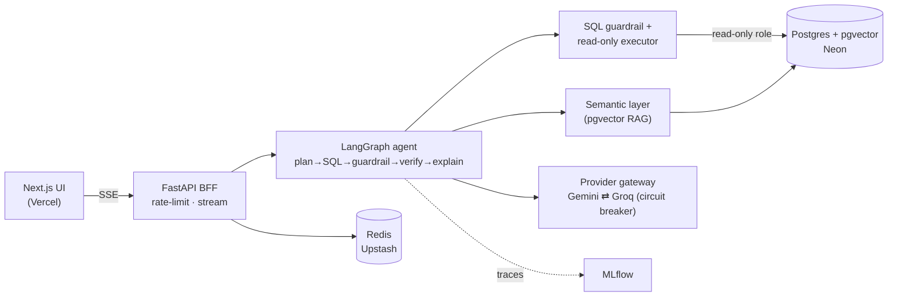

<div align="center">

# DataChat

**Ask open data in plain English. Get safe, verified SQL, a grounded answer, and a chart.**
An agentic natural-language analytics platform over public datasets — built as a real LangGraph agent, evaluated, observable, and secured, running entirely on free tiers.

<!-- Rename freely — "DataChat" is a working title. -->


[**Live demo**](#) · [**Walkthrough video**](#) · [Architecture](#architecture) · [Design deep-dive](./Design.md)

<!-- 👉 Drop the live URL + a 60–90s Loom/YouTube link above once deployed (GOLIVE.md). -->

</div>

---

<!-- 👉 HERO: replace this with an animated GIF of a question → streamed SQL → chart. Put the file at docs/hero.gif -->
> **[ Hero GIF placeholder ]** — `docs/hero.gif`: record yourself asking *"Top 10 countries by CO₂ per capita in 2022"* and the app streaming the plan, SQL, results, and chart.

## The problem & why it matters

<!-- 👉 YOUR WORDS (2–4 sentences). A strong start: "Public datasets like the World Bank's are a goldmine, but you need SQL to use them. I wanted anyone to be able to just ask — safely, and with an answer they can trust." Make it yours. -->

Public open datasets are rich but locked behind SQL and BI tools. Most "text-to-SQL" demos are single-shot prompts that hallucinate columns, run unvalidated queries, and are never evaluated. **DataChat** treats the problem as it actually is in production: a multi-step agent that plans, grounds itself in a semantic layer, generates SQL, **guardrails and verifies it before execution**, repairs its own mistakes, and explains the result — with tracing and an evaluation harness proving it works.

## Key features

- **Real agent, not a prompt** — LangGraph graph: plan → retrieve → generate SQL → guardrail → (human approve) → execute → verify → self-repair → explain → visualize.
- **Safe by construction** — generated SQL passes an AST guardrail chain *and* runs on a read-only, least-privilege DB role with timeouts. No write path exists.
- **Grounded (RAG-to-SQL)** — a semantic layer (schema docs, synonyms, few-shot examples) is retrieved via pgvector so the model doesn't invent columns.
- **Human-in-the-loop** — approve or edit the SQL before it runs; durable state means the pause survives reloads and cold starts.
- **Resilient on free tiers** — provider abstraction with circuit breaker + automatic Gemini→Groq fallback.
- **Evaluated** — execution-accuracy golden set gates every change in CI (the same idea behind the BIRD benchmark).
- **Observable** — every run and model call traced in MLflow, with a versioned prompt registry.
- **Streaming UI** — watch the agent think; results render as a chart from a backend-emitted Vega-Lite spec.
- **$0/month** — every component runs on a permanent free tier or OSS.

## Architecture

A **modular monolith with microservice-grade boundaries** — clean architecture + dependency inversion keep vendors, the DB, and even LangGraph as swappable details. It's microservice-*ready* without paying the ops cost prematurely.



The differentiators — the **agentic LangGraph core**, the **guardrail + read-only-role defence in depth**, the **provider circuit breaker**, and the **eval harness** — are documented in depth in **[Design.md](./Design.md)** and **[TechSpec.md](./TechSpec.md)**. Named patterns (Strategy, Adapter, Decorator, Chain of Responsibility, Circuit Breaker, Template Method, Repository, Builder…) are mapped to SOLID in Design §4.

## Tech stack

| Layer | Choice | Why |
|---|---|---|
| Agent | LangGraph 1.2 | Durable state, checkpoints, HITL interrupts, subgraphs |
| Backend | FastAPI + Pydantic v2 + SQLAlchemy 2 (async) | Typed, async, boundary validation as a control |
| LLMs | Gemini (primary) + Groq (fallback), pluggable | Provider abstraction + circuit breaker; strictly free |
| Data / vectors | Postgres + pgvector (Neon) | One system for relational data *and* embeddings |
| Cache / limits | Redis (Upstash) | Result cache, rate limiting, breaker state |
| LLMOps | MLflow 3.14 | Tracing, prompt registry, evaluation, CI gate |
| Frontend | Next.js 16 + React 19 + Tailwind | Streaming chat; thin Vega-Lite renderer |
| CI/CD | GitHub Actions | Lint, type, test, security, eval on every PR |
| **Cost** | **Free tiers only** | **Runs entirely on $0 — by design, not by luck** |

## Getting started (local, no API keys needed)

Local dev runs against mocks + seed data, so you can try it before creating any accounts.

**Prerequisites:** Docker + Docker Compose, and (for non-container dev) `uv` and `pnpm`.

```bash
git clone https://github.com/<you>/datachat.git
cd datachat
cp .env.example .env          # defaults use USE_MOCKS=true — no real keys required
docker compose up --build     # postgres+pgvector, redis, backend, frontend, mlflow

# seed the sample open-data slice + few-shot examples
docker compose exec backend python -m ingestion.run --dataset seed
```

- App: http://localhost:3000  ·  API docs: http://localhost:8000/docs  ·  MLflow: http://localhost:5000
- Run the checks: `make test` · `make lint` · `make sec` · `make eval`

To use real models later, set `USE_MOCKS=false` and add keys — see **[GOLIVE.md](./GOLIVE.md)** (generated at the end of the build).

## Live deployment

<!-- 👉 Fill URLs after GOLIVE.md -->
- **Frontend:** Vercel (Hobby) · **Backend:** Render (free) · **DB:** Neon · **Cache:** Upstash · **MLflow:** Hugging Face Space
- **Cold-start caveat:** on the free tier the backend sleeps after ~15 min idle and Neon scales to zero. First request after idle shows a brief "waking up" state (~30–60s); a keep-warm ping minimises it. This is an intentional, documented trade-off of a genuinely $0 deployment.

## What I learned / engineering highlights

<!-- 👉 YOUR WORDS. Pick the 2–3 hardest things and say what you learned. Prompts: -->
<!--   • Circuit breaker + fallback over flaky free LLM APIs — what surprised you? -->
<!--   • Why execution-accuracy eval beats string-matching SQL. -->
<!--   • LangGraph durable state + HITL surviving cold starts. -->
<!--   • Defence in depth: guardrail AST *and* a read-only DB role. -->

- **Resilience over free APIs:** a per-provider circuit breaker with Gemini→Groq fallback turns flaky free tiers into a dependable service.
- **Safety as architecture:** an AST guardrail chain plus a read-only least-privilege role means no unsafe SQL can execute even if a layer is bypassed.
- **Evaluation you can trust:** execution-accuracy scoring (result-set equality) gates regressions in CI.
- **Durable agent state:** LangGraph checkpoints let a human-in-the-loop pause survive reloads and cold starts.

## Testing, observability & security

- **Testing** — unit + integration (≥80% on core), agent-eval golden set, Playwright smoke; full matrix in CI. See [ImplementationPlan.md](./ImplementationPlan.md).
- **Observability (MLflow)** — 100% of runs traced (spans, tokens, latency, provider, prompt version) + a versioned prompt registry. See [TechSpec §8](./TechSpec.md).
- **Security (OWASP)** — mapped and **tested** against the **LLM Top 10 (2025)** and **Agentic Top 10 (2026)**: prompt-injection corpus, least-privilege tools, read-only execution, rate limits, bounded loops. See [ImplementationPlan §11](./ImplementationPlan.md).

## Documentation

[PRD](./PRD.md) · [TechSpec](./TechSpec.md) · [AppFlow](./AppFlow.md) · [Design](./Design.md) · [Schema](./Schema.md) · [ImplementationPlan](./ImplementationPlan.md) · [Tracker](./Tracker.md) · [Rules](./Rules.md) · [Security (OWASP matrix)](./SECURITY.md) · [Go-live checklist](./GOLIVE.md)

## License

MIT — see [LICENSE](./LICENSE).
