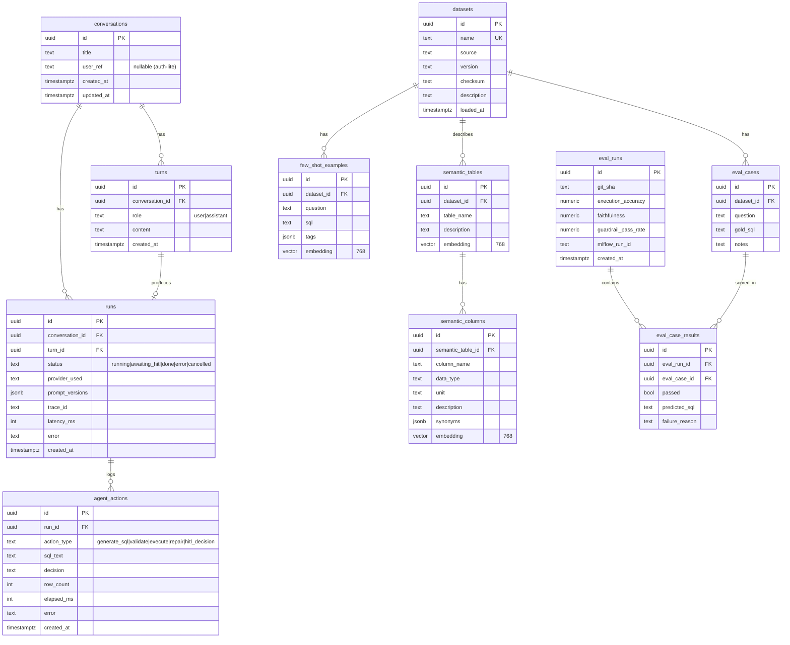
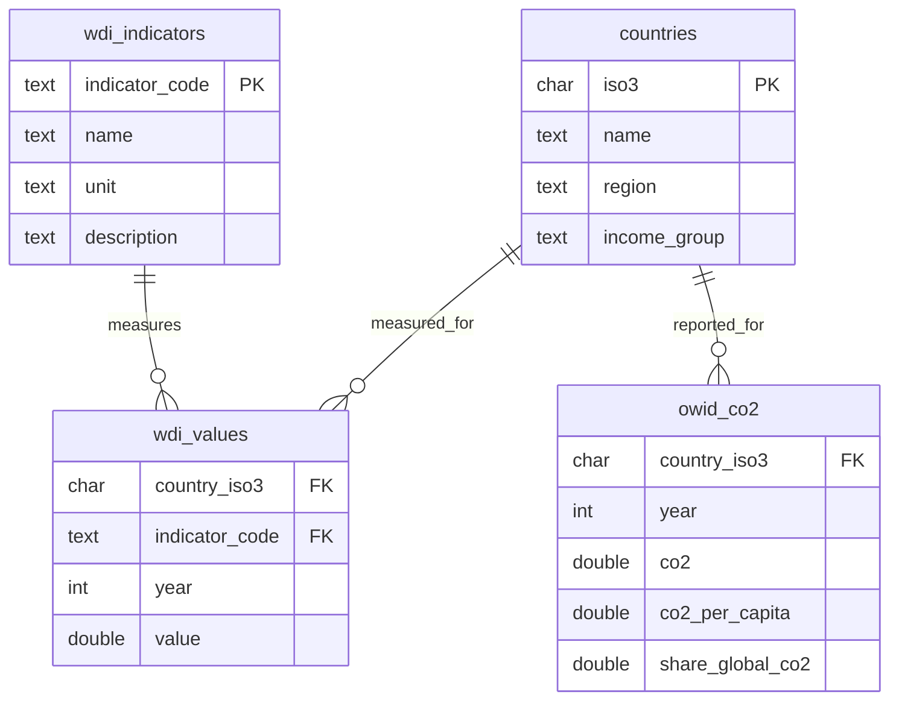

# Schema — DataChat (Data Design)

> Data model for both databases-in-one: the **`app`** schema (metadata, conversations, semantic layer, eval) and the **`analytics`** schema (the open datasets, read-only). Plus pgvector, Redis keys, migrations, seed data, and retention/PII.
> Companion to [Design](./Design.md) and [TechSpec](./TechSpec.md). One Neon Postgres instance, two schemas, strict role separation.

---

## 1. Overview & isolation model

- **`app` schema** — everything the product owns: conversations, runs, audit trail, the semantic layer (+ embeddings), eval cases/runs. Read-write from the app's normal role.
- **`analytics` schema** — the curated open datasets the agent queries. Reachable **only** through a **read-only role** with a statement timeout (see §5). This physical separation is the second layer of the "no writes ever" defence (the guardrail chain is the first).
- **LangGraph checkpointer tables** live in `app` (auto-managed by `langgraph-checkpoint-postgres`).

## 2. ER diagram (app schema)



## 3. Table details (app schema)

Conventions: `uuid` PKs (`gen_random_uuid()`), `timestamptz` in UTC, `NOT NULL` unless noted, FKs `ON DELETE CASCADE` for owned children.

| Table | Notable columns / constraints | Indexes |
|---|---|---|
| `conversations` | `title`, `user_ref` nullable | `(updated_at desc)` |
| `turns` | `role CHECK in ('user','assistant')` | `(conversation_id, created_at)` |
| `runs` | `status CHECK`, `prompt_versions jsonb`, `trace_id` | `(conversation_id, created_at)`, `(status)` |
| `agent_actions` | append-only audit/outbox; never updated | `(run_id, created_at)` |
| `datasets` | `name UNIQUE`, `checksum`, `version` | `(name)` |
| `semantic_tables` | `embedding vector(768)` | HNSW on `embedding` |
| `semantic_columns` | `unit`, `synonyms jsonb`, `embedding vector(768)` | HNSW on `embedding`, `(semantic_table_id)` |
| `few_shot_examples` | `question`, `sql`, `embedding vector(768)` | HNSW on `embedding` |
| `eval_cases` | `gold_sql` | `(dataset_id)` |
| `eval_runs` | metrics + `mlflow_run_id` | `(created_at desc)` |
| `eval_case_results` | `passed`, `predicted_sql`, `failure_reason` | `(eval_run_id)` |

## 4. Analytics schema (curated open data, read-only)

Bounded on purpose (Neon free = 0.5 GB). v1 loads a slice of **World Bank WDI** + **Our World in Data (CO₂)**. Star-ish shape: dimension `countries`, catalog `wdi_indicators`, fact `wdi_values`.



Constraints: `wdi_values` PK `(country_iso3, indicator_code, year)`; `owid_co2` PK `(country_iso3, year)`; FKs to `countries`. Indexes on `(indicator_code, year)` and `(country_iso3, year)` for the common filter/aggregate patterns. All numeric measures nullable (real-world gaps — this is exactly what BIRD-style "dirty real data" tests).

## 5. Read-only role & execution safety (the security spine)

```sql
-- Roles: app_rw (migrations + app CRUD on app schema) and analytics_ro (query execution).
CREATE ROLE analytics_ro NOLOGIN;
GRANT USAGE ON SCHEMA analytics TO analytics_ro;
GRANT SELECT ON ALL TABLES IN SCHEMA analytics TO analytics_ro;
ALTER DEFAULT PRIVILEGES IN SCHEMA analytics
  GRANT SELECT ON TABLES TO analytics_ro;
REVOKE ALL ON SCHEMA app FROM analytics_ro;   -- cannot touch app data

-- A dedicated login user for the executor connection pool, in the RO role:
CREATE ROLE datachat_exec LOGIN PASSWORD :'exec_pw' IN ROLE analytics_ro;
ALTER ROLE datachat_exec SET statement_timeout = '5s';
ALTER ROLE datachat_exec SET default_transaction_read_only = on;
ALTER ROLE datachat_exec SET search_path = analytics;
```

The **executor uses its own engine/pool** as `datachat_exec` (Bulkhead). Even if every guardrail were bypassed, the database itself would reject any write, any cross-schema read, and any query over 5s. Defence in depth (FR-23, LLM06, ASI02/ASI03).

## 6. pgvector strategy

- **Dimension:** 768 (Gemini `text-embedding-004`; if the embedding provider changes, dimension is a config + migration change).
- **Index:** `HNSW` with `vector_cosine_ops` (pgvector 0.8) — good recall/latency for our small corpus; `IVFFlat` documented as the low-memory alternative.
- **What's embedded:** table descriptions, column descriptions (+ synonyms/units), and few-shot `question` text. Retrieval = cosine top-k over each set.
- **Query:** `SELECT ... ORDER BY embedding <=> :q LIMIT :k`. Because the corpus is tiny, index build/maintenance cost is negligible.

## 7. Redis (Upstash) key patterns & TTLs

Budget-aware: 500k commands/month. Cache only hot paths; short TTLs.

| Key | Value | TTL | Purpose |
|---|---|---|---|
| `rl:{scope}:{id}:{window}` | counter | = window (e.g. 60s) | Rate limit per IP/session (token/fixed window) |
| `quota:global:{yyyymmdd}` | counter | 24h | Global daily LLM-call cap (protects free tiers) |
| `cache:answer:{sha256(dataset+question)}` | answer JSON | 1h | Skip the whole agent run on repeat questions |
| `cache:sql:{sha256(sql)}` | result JSON | 15m | Skip re-execution of identical SQL |
| `idem:{idempotency_key}` | run_id | 24h | De-dupe retried `POST /chat` |
| `breaker:{provider}` | state + opened_at | cooldown (e.g. 30s) | Shared circuit-breaker state across restarts |

No user content beyond the transient cache lives in Redis; nothing sensitive is persisted there.

## 8. Migrations (Alembic)

- Async Alembic env; **autogenerate** for the `app` schema from SQLAlchemy models.
- **Hand-written migrations** for: enabling `pgvector` (`CREATE EXTENSION IF NOT EXISTS vector`), creating the `analytics` schema, and the **roles/grants** in §5 (security-critical → explicit, reviewed, not autogenerated).
- The `analytics` **data** is populated by the ingestion job, not migrations (migrations own structure + roles; ingestion owns rows).
- Every migration is reversible; CI runs `upgrade head` then `downgrade -1` on a scratch DB.

## 9. Seed data (for local dev without any keys)

- A tiny fixture slice (`tests/fixtures/analytics_seed.sql`): ~30 countries, ~10 WDI indicators, a few years, and the OWID CO₂ subset — enough to answer the golden set locally.
- `few_shot_examples` and `eval_cases` seed files so `docker compose up` yields a working, testable app with **mock** LLM/embeddings (FR-25).

## 10. Retention & PII

- **No PII in datasets** — public, aggregate open data only (LLM02).
- **User questions** (`turns.content`) are user-authored text; retained **90 days** by default, then purged by a scheduled job (`scripts/purge_old_turns.py`). Configurable via `DATA_RETENTION_DAYS`.
- **IP addresses** are used only for rate limiting and live **only in Redis** with short TTLs — never written to Postgres. If logged for abuse investigation, they are **hashed**.
- **Audit trail** (`agent_actions`) keeps SQL + decisions (no PII) for debugging/security; same 90-day window.
- Secrets never touch the DB or logs (see [Rules](./Rules.md)).
