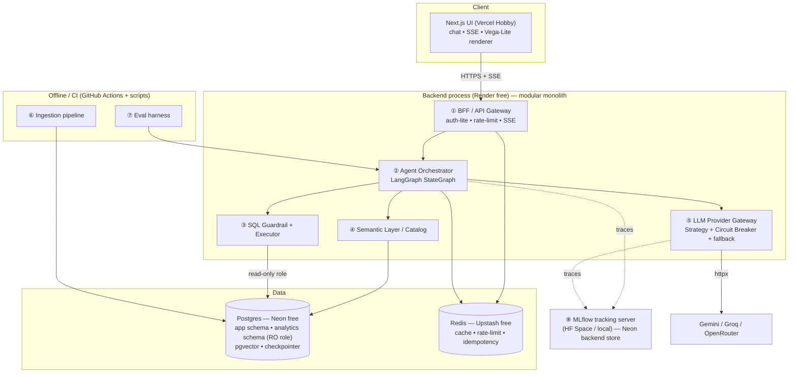
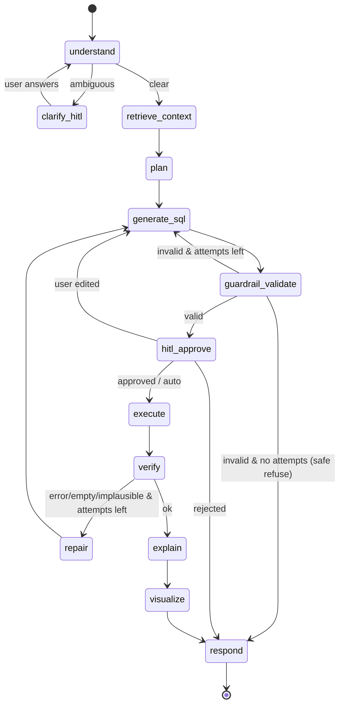

# TechSpec — DataChat

> **Technical Specification**
> Companion to [PRD](./PRD.md). Deep design in [Design](./Design.md); data in [Schema](./Schema.md); flows in [AppFlow](./AppFlow.md).
> All versions verified 2026-07-23. Claude Code MUST re-verify + pin exact latest patch at build time and record them in `Tracker.md`.

---

## 1. Stack & versions

| Layer | Choice | Version (Jul 2026) | Why this, not the alternative |
|---|---|---|---|
| Language (BE) | Python | 3.12+ | Async maturity; ecosystem for LangGraph/MLflow |
| API framework | FastAPI | 0.136.x | Async-first, Pydantic-native, SSE-friendly. (Alt: Litestar — smaller ecosystem) |
| Validation | Pydantic | 2.10.x | Boundary validation = a security control, not just DX |
| ORM | SQLAlchemy (async) + asyncpg | 2.0.x | Mature, typed, `Repository`-friendly. (Alt: SQLModel — thinner, less control) |
| Migrations | Alembic | 1.14.x | Standard, autogenerate + async template |
| Agent framework | **LangGraph** | **1.2.x** (1.2.9) | Durable state, checkpointers, HITL `interrupt`, subgraphs — the core requirement |
| LLM glue | LangChain core | 1.x | Only for message/tool types; kept at the edges |
| Checkpointer | langgraph-checkpoint-postgres | latest | Durable graph state across cold starts (NFR-3) |
| SQL safety | sqlglot | 26.x | Parse/AST-validate generated SQL (dialect-aware). (Alt: sqlparse — no real AST) |
| Embeddings | Gemini embeddings (free) via `EmbeddingProvider` port; BGE-small local for offline | — | Keep CPU off the tiny host at query time; swappable |
| Vector store | **pgvector** (Postgres ext) | 0.8.x | One system to run; free on Neon. (Alt: Qdrant free — extra service) |
| Cache / rate-limit | Redis (Upstash) | server-side | Serverless, free, single-region |
| LLMOps | **MLflow** | **3.14.x** | Tracing + prompt registry + `mlflow.genai.evaluate` + pytest CI gate |
| Logging | structlog | latest | Structured JSON logs + correlation IDs |
| HTTP client | httpx | latest | Async provider calls, timeouts |
| Frontend | Next.js (App Router) + React 19 + TypeScript 5 | Next 16.2.x | Streaming UI, Vercel-native |
| Styling | Tailwind CSS | 4.x | Fast, no design overhead |
| Charts | Vega-Lite via `vega-embed` | latest | Backend emits a **declarative spec**; FE is a thin renderer (keeps FE minimal) |
| Tests | pytest, pytest-asyncio, vitest, Playwright (smoke) | latest | Unit/integration/agent-eval/e2e |
| Security tools | bandit, semgrep, pip-audit, npm audit, gitleaks | latest | SAST + deps + secret scan in CI |
| CI/CD | GitHub Actions | — | Free; runs lint/type/test/security/eval |
| Containers | Docker + docker-compose | — | Local == prod topology (NFR-8) |
| Package mgmt | uv (BE), pnpm (FE) | latest | Fast, lockfile-based (supply-chain hygiene) |

## 2. Architecture

**Guiding decision — a modular monolith with explicit service boundaries, not physical microservices (yet).**
The free tier cannot run eight always-on services, and splitting a young system into networked services is the classic *distributed monolith* anti-pattern (all the ops pain, none of the benefit). So we build **one deployable backend** whose internal modules have **microservice-grade boundaries** (clean-architecture ports + dependency inversion). Each logical service could be extracted to its own process later **without touching the domain code**. This is a deliberate, defensible choice — "microservice-ready, not microservice-burdened."

**Logical services (boundaries) → physical deployment (free tier):**

## 3. Service responsibilities & contracts

| # | Service | Responsibility | Key inbound contract |
|---|---|---|---|
| ① | **BFF / API Gateway** | Single entry; request validation; rate-limit; auth-lite; SSE fan-out; correlation IDs | REST + SSE (see §4) |
| ② | **Agent Orchestrator** | Owns the LangGraph graph, state, checkpoints, HITL interrupts | `run(question, conversation_id, options) -> AsyncIterator[Event]` |
| ③ | **SQL Guardrail + Executor** | Validates SQL (Chain of Responsibility) then executes read-only with limits | `validate(sql) -> ValidationResult`; `execute(sql) -> ExecutionResult` |
| ④ | **Semantic Layer / Catalog** | Serves schema docs, synonyms, units, few-shot examples; RAG retrieval | `retrieve(question) -> RetrievedContext` |
| ⑤ | **LLM Provider Gateway** | Uniform LLM interface; provider selection; circuit breaker; fallback; retries | `complete(request) -> Completion`; `embed(text) -> Vector` |
| ⑥ | **Ingestion** | Fetch → validate → load open datasets; build semantic layer; embed docs | CLI: `python -m ingestion.run --dataset wdi` |
| ⑦ | **Eval harness** | Run golden set; execution-accuracy + faithfulness scorers; log to MLflow; CI gate | CLI + pytest; `pytest -m eval` |
| ⑧ | **MLflow** | Trace store, prompt registry, eval runs | MLflow tracking URI |

## 4. Public API contract

Base: `/api/v1`. All responses JSON except the chat stream (SSE). Every request carries/receives `X-Request-ID`.

| Method | Path | Purpose | Notes |
|---|---|---|---|
| POST | `/chat` | Ask a question; returns an **SSE stream** | Body: `{conversation_id?: str, question: str, options?: {approve_sql?: bool}}`. Idempotency-Key header supported. |
| POST | `/chat/{run_id}/resume` | Resume a HITL-interrupted run | Body: `{decision: "approve"|"edit"|"reject", edited_sql?: str}` |
| GET | `/conversations/{id}` | Conversation history | Paginated |
| GET | `/datasets` | List datasets + semantic summary | For the UI dataset picker |
| GET | `/health` | Liveness | No DB hit |
| GET | `/ready` | Readiness (DB/Redis/provider reachable) | Used by keep-warm + deploy checks |

**SSE event envelope:** `event: <type>\ndata: <json>\n\n`. Event types:
`status` (stage transitions) · `plan` · `sql` · `awaiting_approval` (HITL; includes `run_id`) · `rows` (columns + capped rows) · `explanation_delta` (streamed prose) · `chart_spec` (Vega-Lite JSON) · `error` (safe message + code) · `done` (final summary + trace_id).

## 5. LangGraph agent design

**State schema** (`app/application/agent/state.py`, a `TypedDict` with reducers):

| Field | Type | Notes |
|---|---|---|
| `conversation_id`, `run_id` | str | correlation |
| `question` | str | current turn |
| `history` | list[Turn] | prior turns (windowed) |
| `retrieved_schema` | list[TableDoc] | from Semantic Layer (RAG) |
| `retrieved_examples` | list[Example] | few-shot NL→SQL |
| `plan` | Plan \| None | steps / target tables |
| `candidate_sql` | str \| None | current SQL |
| `validation` | ValidationResult \| None | guardrail output |
| `hitl` | HITLState | required?, decision, edited_sql |
| `execution` | ExecutionResult \| None | columns, rows (capped), row_count, elapsed, error |
| `repair_attempts` | int | bounded by `MAX_REPAIR_ATTEMPTS` |
| `verification` | VerificationResult \| None | plausibility check |
| `explanation` | str \| None | grounded prose |
| `chart_spec` | dict \| None | Vega-Lite |
| `error` | str \| None | terminal error |
| `meta` | RunMeta | provider_used, prompt_versions, trace_id |

**Nodes** (each = one responsibility, SRP):
`understand` → `retrieve_context` → `plan` → `generate_sql` → `guardrail_validate` → `hitl_approve` (conditional interrupt) → `execute` → `verify` → (`repair` loop) → `explain` → `visualize` → `respond`.

**Graph:**

- **Checkpointer:** `PostgresSaver` (langgraph-checkpoint-postgres). Every super-step is persisted → durable state, HITL resume, cold-start survival (NFR-3).
- **HITL:** `interrupt()` before `execute` (approve SQL) and inside `understand` (clarify). The BFF surfaces `awaiting_approval`; `/chat/{run_id}/resume` injects the human decision and continues from the checkpoint.
- **Tools (least privilege — LLM06/ASI02):** `schema_retriever` (read), `example_retriever` (read), `sql_executor` (read-only role only). No tool can write. Tool set is fixed at build (no dynamic tool loading).
- **Bounded loops (ASI08 cascading failures):** `repair_attempts` and provider retries are hard-capped; exceeding them yields a graceful terminal message, never an infinite loop.

## 6. LLM provider abstraction & fallback

**Port:** `LLMProvider` with `complete(LLMRequest) -> LLMResponse` and `embed(...)`. One **Adapter** per vendor (Gemini, Groq, OpenRouter). Selection is a **Strategy** (`ProviderRouter`); resilience is a **Decorator** stack (tracing → cache → circuit-breaker → retry) wrapping each adapter.

- **Order:** Gemini (primary — big daily quota, 1M context, cheap-latency Flash) → Groq (fast fallback, 14.4k req/day) → OpenRouter (thin 50/day emergency only; disabled by default to stay strictly $0).
- **Circuit breaker** per provider: opens after N consecutive failures/429s (`CLOSED→OPEN→HALF_OPEN`), skips open providers, periodically probes to recover.
- **Retry:** exponential backoff + jitter, capped attempts; 429 respects `Retry-After`.
- **Selection policy:** task-aware (e.g., SQL-gen → Gemini for context; short classify → Groq for speed) + health-aware (skip open breakers).
- **Config-driven:** providers, order, and models come from config/env — adding a provider = new adapter + config, **zero core changes** (OCP).

## 7. Semantic layer & retrieval (RAG-to-SQL)

The semantic layer is what makes generation *grounded* instead of hallucinated. For each dataset we store: table + column descriptions, units, value synonyms (e.g., "USA" → `USA`/`United States`), allowed join keys, and **curated few-shot NL→SQL pairs**. These are embedded into **pgvector**.

At query time: embed the question → retrieve top-k relevant tables/columns + few-shot examples → inject only that subset into the SQL-gen prompt. This (a) fits small context, (b) narrows the surface to fight the text-to-SQL "performance cliff," and (c) is the project's genuine **RAG** component. Retrieval strategy is a **Strategy** port (dense today; hybrid/BM25 swappable).

## 8. MLflow integration

- **Tracing:** MLflow autolog + manual spans wrap the graph run and every node/LLM/tool call (inputs, outputs, latency, tokens, provider, prompt version). 100% coverage (FR-18).
- **Prompt registry:** SQL-gen, repair, explain, verify, clarify prompts are registered and versioned; the loaded version ID is written into state and the trace (FR-19).
- **Evaluation:** `mlflow.genai.evaluate` over the golden set with scorers: `execution_accuracy` (custom — compares result sets), `sql_valid` (parses + passes guardrails), `explanation_faithfulness` (LLM-judge vs returned rows), plus latency/cost. Baseline saved; CI fails on regression beyond threshold (FR-20).
- **Backend store:** Neon Postgres (durable). **Artifact store:** local/HF-Space disk (ephemeral on free hosts — documented trade-off).

## 9. Observability & logging

structlog JSON logs with a correlation ID (`X-Request-ID`) propagated FE→BFF→graph→provider. Log levels tuned so **no prompt secrets or full user PII** are logged (LLM02/LLM07). Minimal Prometheus-style counters (requests, provider failures, breaker state, cache hit-rate) exposed for the dashboard; MLflow holds the deep traces. OpenTelemetry-compatible span naming.

## 10. Configuration & secrets

Pydantic `Settings` loads from env only. Nothing secret in code or git. `.env.example` documents every var with safe placeholders; local dev uses mocks so **no real keys are needed to run** (FR-25). Real keys are created by the user at go-live (`GOLIVE.md`).

## 11. $0 cost table (proof)

| Component | Provider (free tier) | Verified limit (2026-07-23) | Mitigation for the limit |
|---|---|---|---|
| LLM (primary) | **Gemini API** | Gemini 3 Flash **1,500 req/day**, 1M context; 2.5 Flash 250/day (Pro is paid-only) | Cache results; rate-limit users; fall back to Groq |
| LLM (fallback) | **Groq** | **14,400 req/day**, 30 RPM, 6k TPM | Circuit-breaker fail-over; short prompts routed here |
| LLM (emergency) | OpenRouter | 50 req/day pure-free (1,000 needs one-time $10) | Disabled by default to stay strictly $0 |
| Embeddings | Gemini embeddings (free) | Shares Gemini quota | Pre-embed semantic layer offline; 1 embed/query |
| Postgres + pgvector | **Neon** | **0.5 GB / 100 compute-hrs per month**, scale-to-zero @ 5 min | Keep corpus small & bounded; connection pooling; keep-warm ping |
| Cache / rate-limit | **Upstash Redis** | **256 MB, 500k commands/month** (~16.7k/day) | Short TTLs; cache only hot results |
| Frontend host | **Vercel Hobby** | 100 GB BW, 1M invocations, 4 CPU-hrs, 10s fn timeout, **non-commercial** | Static-first; long work is on the backend, not Vercel fns |
| Backend host | **Render free** (alt: HF Spaces, Koyeb) | 512 MB / 0.1 CPU, **spins down ~15 min idle** | Keep-warm ping (cron-job.org / GH Actions) + "waking up" streaming UX + durable checkpoints |
| MLflow | HF Space / local | Free; disk ephemeral | Neon backend store keeps runs; artifacts best-effort |
| CI/CD | **GitHub Actions** | Free (generous for public repos) | Cache deps; scope eval matrix |
| Uptime ping | cron-job.org | Free | Every ~10–14 min to `/ready` |

**Total: $0/month.** The only money mentioned anywhere (OpenRouter's optional one-time $10) is explicitly **off** by default.

## 12. Security overview

Full mitigation matrix is in [ImplementationPlan §Security] and enforced by tests. Design-level spine:
- **Untrusted-by-default:** every user input and every LLM output is validated at boundaries (LLM01/LLM05).
- **Least privilege:** generated SQL runs only via a **read-only role** scoped to the `analytics` schema, with `statement_timeout` + row cap; no tool can write (LLM06/ASI02/ASI03).
- **Defence in depth:** guardrail AST checks **and** the DB role both block writes — either alone would suffice (FR-23).
- **Bounded consumption:** rate limits, quotas, capped loops, circuit breakers (LLM10/ASI08).
- **No secrets in prompts or code** (LLM07); pinned deps + scanners (LLM03/ASI04); curated data only (LLM04/ASI06); HITL for transparency, never bypassable server-side (ASI09).

## 13. Deployment topology & cold-start strategy

- **FE:** Vercel Hobby (auto CI/CD from GitHub).
- **BE:** Render free web service (Docker). Alt documented: HF Spaces / Koyeb.
- **DB:** Neon (Postgres 16 + pgvector); app schema, `analytics` schema, read-only role, checkpointer tables.
- **Redis:** Upstash.
- **MLflow:** HF Space (or local in docker-compose) with Neon backend store.
- **Cold-start UX:** on `/chat`, if the backend was asleep, the first SSE `status` event is `waking` and the UI shows a friendly warmup state; `/ready` is pinged every ~10–14 min to minimise sleeps; Neon resumes in ~sub-second; durable checkpoints mean any interrupted run resumes intact.

*Cross-references:* graph & flows → [AppFlow](./AppFlow.md); classes & patterns → [Design](./Design.md); tables & indexes → [Schema](./Schema.md); build order → [ImplementationPlan](./ImplementationPlan.md).
